# Instacart Orders — Exploratory Data Analysis

Exploratory data analysis of the Instacart online grocery ordering dataset, covering data cleaning, missing-value handling, and customer/product behavior analysis across ~4.5M order-product records and ~479K orders.

## Project Overview

This project cleans and analyzes five relational Instacart tables to answer three core questions:
- **When do customers order?** (day-of-week and hour-of-day patterns)
- **What do customers buy, and what do they buy again?** (top products, reorder behavior)
- **How do ordering habits vary across customers?** (order frequency, basket size, reorder loyalty)

The analysis follows a full pipeline: data quality audit → duplicate detection → missing-value investigation and treatment → exploratory visualization → behavioral segmentation insights.

## Dataset

Five CSV files (semicolon-delimited), representing a relational e-commerce schema:

| Table | Shape | Description |
|---|---|---|
| `orders` | 478,967 × 6 | One row per order: user, order number, day of week, hour, days since prior order |
| `products` | 49,694 × 4 | Product catalog: name, aisle, department |
| `departments` | 21 × 2 | Department ID → name lookup |
| `aisles` | 134 × 2 | Aisle ID → name lookup |
| `order_products` | 4,545,007 × 4 | One row per product per order: cart position, reorder flag |

Raw CSVs live in [`data/`](data/), along with a full data dictionary and entity-relationship notes in [`data/README.md`](data/README.md).

## Data Cleaning

**1. Duplicate orders**
- 15 fully duplicated rows found in `orders`, all placed on Wednesday at 2:00 AM.
- Of 121 total orders in that specific day/hour slot, all 15 duplicates were confirmed and removed via `drop_duplicates()`.
- Post-cleanup: 0 duplicate rows, 0 duplicate `order_id` values. Final shape: 478,952 × 6.

**2. Duplicate products**
- No duplicate rows or `product_id` values at face value.
- Case-insensitive check on lowercased product names surfaced 1,361 apparent duplicates — investigation showed these were almost entirely driven by missing (`NaN`) names collapsing together.
- After excluding `NaN`, 104 genuine duplicate product names remained (kept as-is; not deduplicated, since duplicate names can still map to distinct `product_id`s).

**3. Missing product names (1,258 rows)**
- All missing `product_name` values traced to a single combination: `aisle_id = 100` ("missing") and `department_id = 21` ("missing").
- Conclusion: not random data loss — these are real ordered products that were never named in the source system, filed under a placeholder aisle/department bucket.
- Treatment: filled with `'Unknown'` rather than dropped, preserving the order/product relationship.

**4. Missing `days_since_prior_order` (28,817 rows)**
- Investigated and confirmed: 100% of missing values correspond to `order_number == 1` (a customer's very first order, which by definition has no prior order to measure from).
- Structural missingness, not a data quality defect — left as `NaN` (no fabricated placeholder).

**5. Missing `add_to_cart_order` (836 rows)**
- Traced to only 70 unique orders, all of which contain more than 64 items (min 65, max 127 items per order).
- Cause: cart position values appear to be capped/truncated at 64 in the source data, so anything beyond the 64th item lost its position.
- Treatment: filled with sentinel value `999` and converted column from `float` to `int`.

**6. Range validation**
- `order_hour_of_day` confirmed within 0–23, `order_dow` confirmed within 0–6. No out-of-range values.

## Key Findings

### Ordering time patterns
- Orders peak between **10 AM and 4 PM**, with the sharpest single hour at 10 AM (40,578 orders). Activity is minimal overnight (as low as 765 orders at 4 AM).
- **Saturday (62,649 orders)** and **Sunday (day 0, 84,090 orders)** — the two highest-volume days — outpace **midweek (days 3–4, ~60K orders)**.

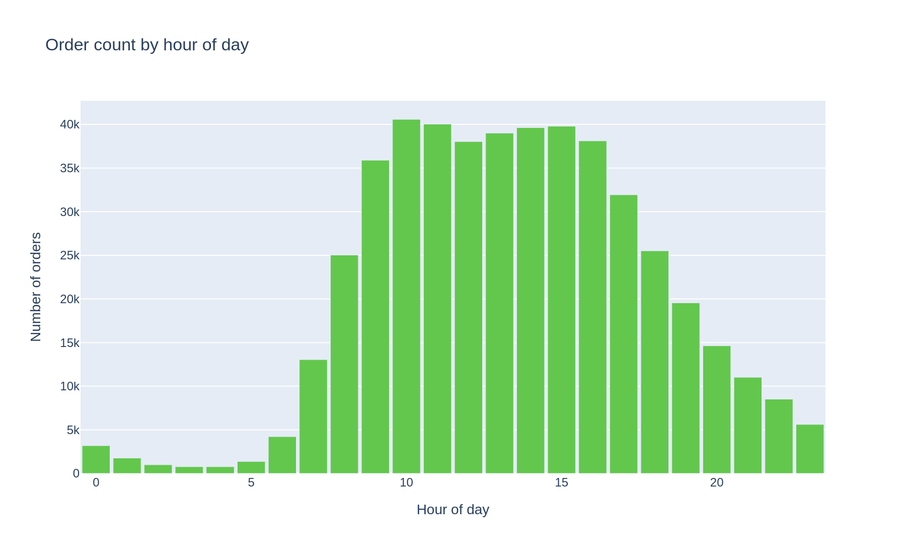
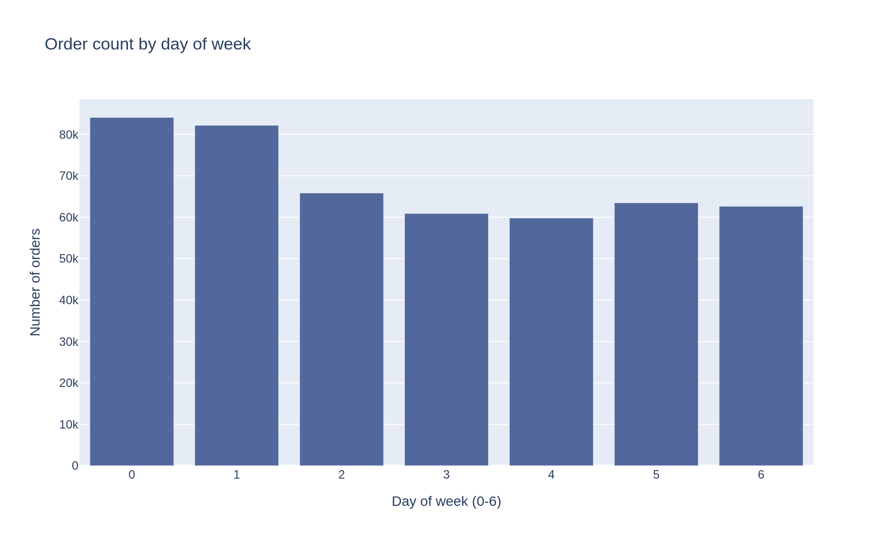

- Wednesday vs. Saturday hourly comparison: both days peak in the same 10 AM–4 PM window, but Saturday's curve is flatter (spread evenly through the day, no work schedule shaping it), while Wednesday shows a sharper 9–11 AM ramp-up consistent with a workday routine.

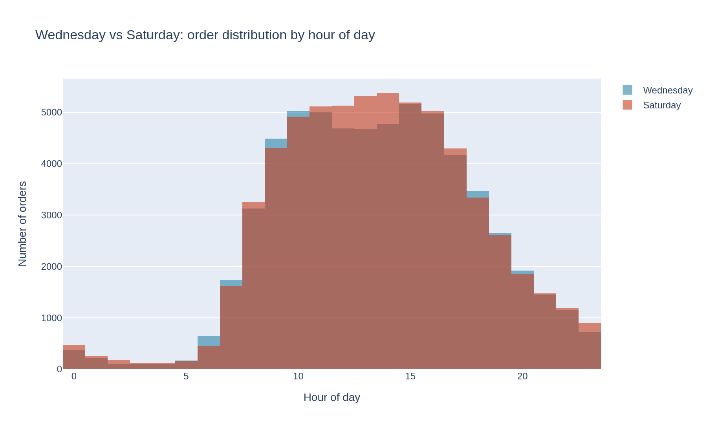

### Reorder cadence
- `days_since_prior_order` ranges from 0 to 30, with a distribution that has a sharp spike exactly at 30 — evidence of **top-coding** (values beyond 30 days were likely capped, not naturally tapering off).
- Secondary spikes appear at 7, 14, 21, and 28 days, indicating a **weekly shopping rhythm** for a meaningful share of customers.

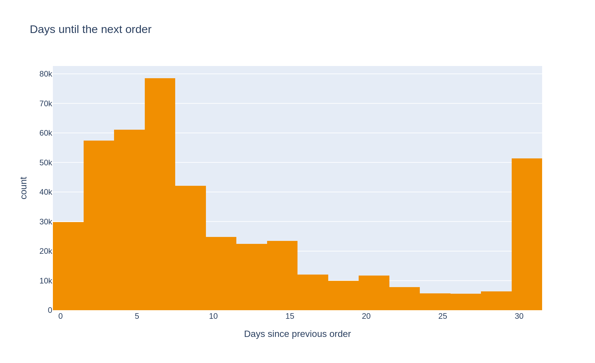

### Customer order frequency
- 157,437 unique customers placed a combined set of orders; the median customer has placed **9 orders** (mean 15.6, right-skewed).
- Distribution is classic long-tail: most customers order only a handful of times (1–5), while a smaller group are frequent repeat shoppers (up to 100 orders capped).

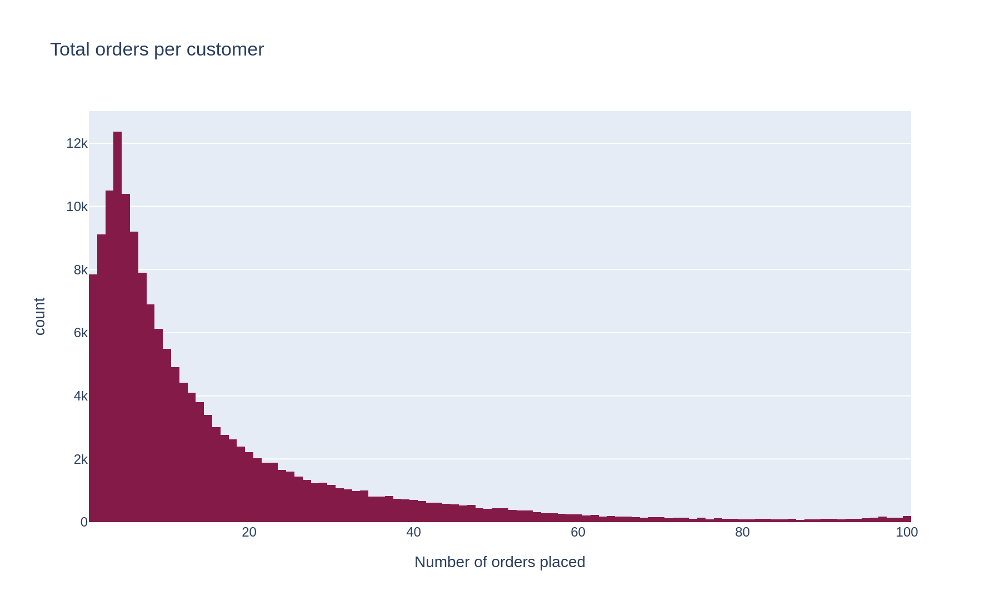

### Basket size
- Median basket size: **8 items** per order (mean 10.1, right-skewed).
- Most orders fall between 1 and 15 items; baskets of 30+ items are rare outliers.

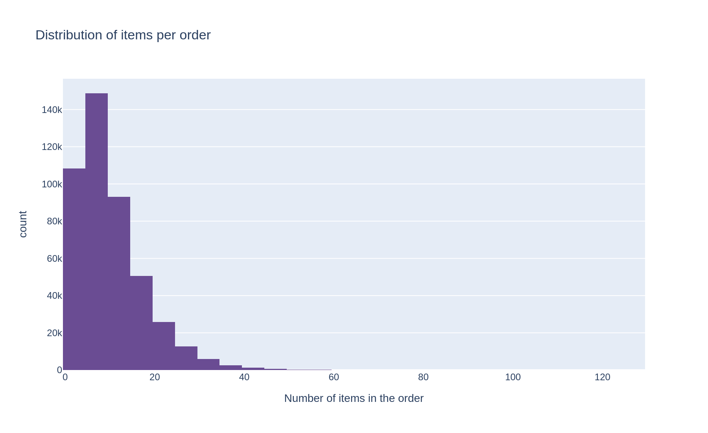

### Top products
| Rank | Product | Orders |
|---|---|---|
| 1 | Banana | 66,050 |
| 2 | Bag of Organic Bananas | 53,297 |
| 3 | Organic Strawberries | 37,039 |
| 4 | Organic Baby Spinach | 33,971 |
| 5 | Organic Hass Avocado | 29,773 |

The top-20 most-ordered list is dominated almost entirely by fresh produce.

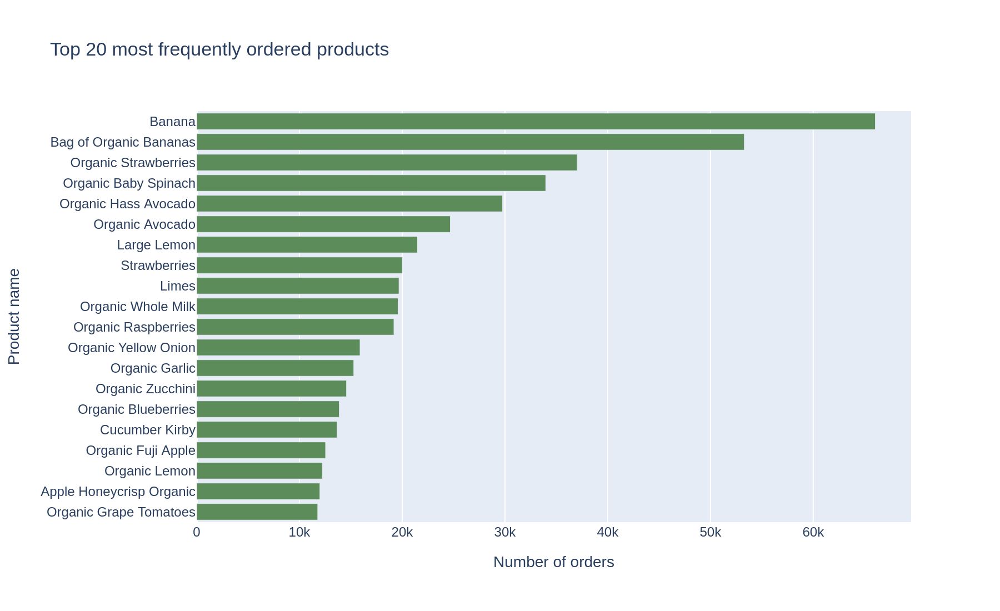

### Reorder behavior
- The most-reordered products mirror the most-ordered products almost exactly (Banana: 55,763 reorders; Bag of Organic Bananas: 44,450) — high purchase volume and high loyalty go hand in hand for produce staples.
- Restricting to products with ≥50 total orders (to avoid unstable ratios from 1–2 order products), the **highest reorder-proportion products** are dominated by beverages and dairy staples (e.g., DanActive Vanilla Probiotic Dairy Drink at 90.8%, Lemon Lime Seltzer at 89.4%), suggesting habitual, low-consideration repurchase categories.
- Across all qualifying products, reorder proportion clusters mostly between **0.3 and 0.7** — roughly half of a typical product's orders are repeat purchases.
- At the customer level, reorder proportion is widely spread (mean 49.5%, min 0%, max 100%), splitting shoppers into two loose behavioral segments: **"loyal repeaters"** (near 100%) and **"explorers"** (near 0%) who rarely rebuy the same item.

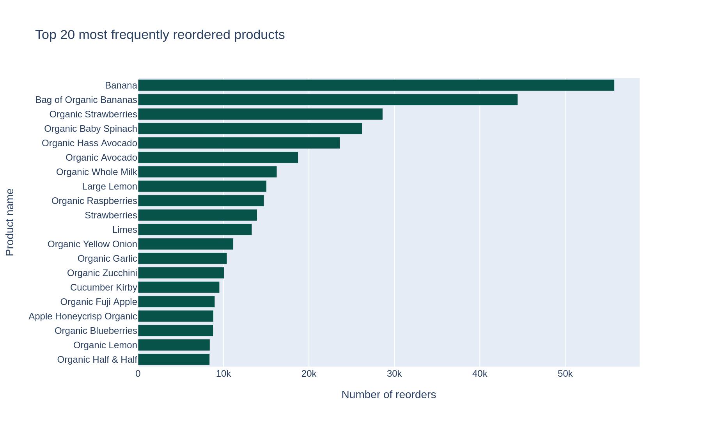
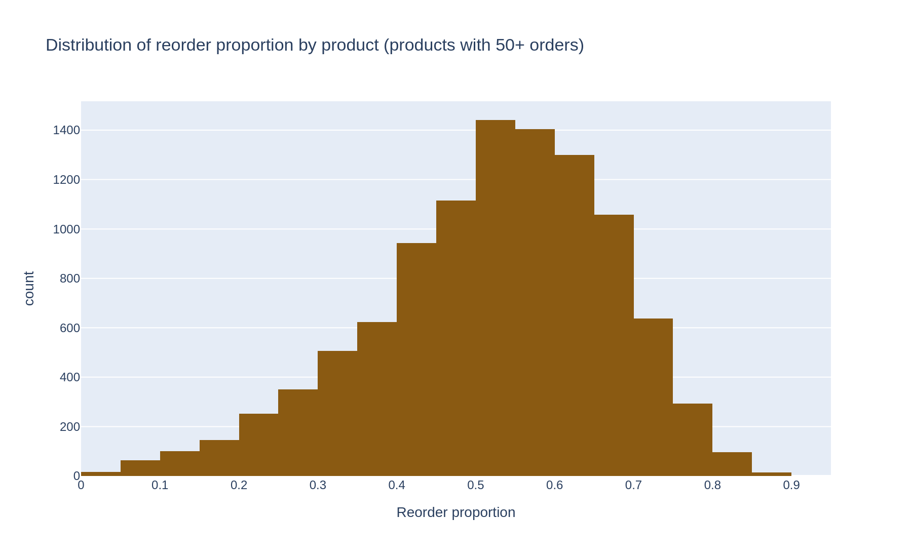
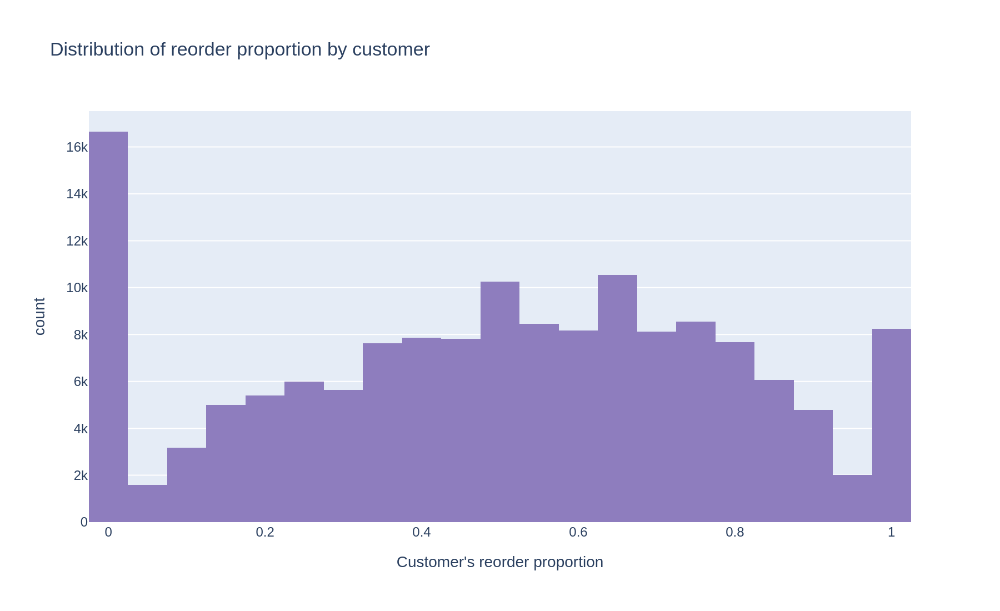

### First item added to cart
- **Banana** is the single most common first item added to a cart (15,562 times), an even wider lead than in the overall order-count ranking — suggesting shoppers often start their route in the produce section.

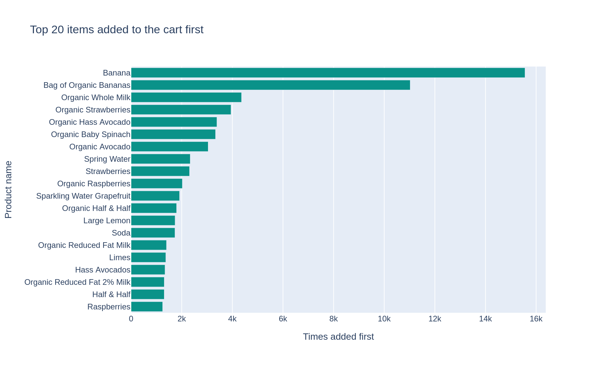

All chart files, plus a one-line takeaway per chart, are indexed in [`charts/README.md`](CHARTS/README.md).

## Business Implications

- **Staffing & fulfillment**: order volume peaks 10 AM–4 PM and on weekends — inventory replenishment and picking staff should be scheduled around this window.
- **Retention targeting**: the wide spread in customer-level reorder proportion (0% to 100%) is a usable segmentation signal — "explorer" customers may respond better to discovery-driven marketing, while "repeaters" are prime candidates for subscribe-and-save offers on their staple items.
- **Category strategy**: fresh produce (bananas, spinach, avocado, strawberries) drives both volume and loyalty — a natural anchor category for promotions or loyalty programs, while high reorder-rate niche items (probiotic drinks, seltzer) indicate strong habitual purchase categories worth stocking reliably.
- **Data quality flag for production use**: the 30-day cap on `days_since_prior_order` and the 64-item cap on `add_to_cart_order` are known top-coding artifacts — any downstream model using these fields as continuous variables should account for the ceiling effect rather than treating capped values at face value.

## Tech Stack

- Python 3
- pandas, numpy
- plotly (express & graph_objects) for interactive visualizations

## Project Structure

```
.
├── README.md
├── Sadıqov_Ədalət_project.ipynb   # Main analysis notebook
├── Datasets_for_data_analysis/
│   ├── README.md                  # Data dictionary & entity relationships
│   ├── instacart_orders.csv
│   ├── products.csv
│   ├── departments.csv
│   ├── aisles.csv
│   └── order_products.csv
└── charts/
    ├── README.md                  # Chart index with takeaways
    ├── 01_orders_by_hour.png
    ├── 02_orders_by_day_of_week.png
    ├── 03_days_since_prior_order.png
    ├── 04_wednesday_vs_saturday.png
    ├── 05_orders_per_customer.png
    ├── 06_top20_ordered_products.png
    ├── 07_items_per_order.png
    ├── 08_top20_reordered_products.png
    ├── 09_reorder_proportion_by_product.png
    ├── 10_reorder_proportion_by_customer.png
    └── 11_top20_first_added.png
```

## How to Run

1. Clone the repository
2. The five source CSVs are already included in [`data/`](data/) — no external download needed
3. Install dependencies: `pip install pandas numpy plotly`
4. Run the notebook top to bottom in Jupyter

## Author

Ədalət Sadıqov
